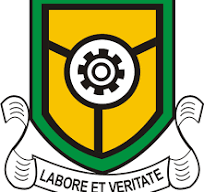

# 🎓 Yabatech EduBot

**Yabatech EduBot** is a simple and smart chatbot designed to help students and prospective applicants at Yaba College of Technology. Built using [Streamlit](https://streamlit.io/), it answers frequently asked questions using fuzzy matching from a structured knowledge base (Google Sheets).



---

## ✨ Features

- 🔍 Ask questions about admissions, payments, courses, hostels, etc.
- 📚 Uses fuzzy matching (`RapidFuzz`) to find the best answer
- 🔗 Loads question-answer data from Google Sheets
- 📱 Clean and responsive Streamlit interface

---

## 🛠️ Tech Stack

- Python 3.9+
- Streamlit
- Pandas
- RapidFuzz
- Google Sheets (CSV export)

---

## 📁 File Structure

├── chatbot_app/
│   ├── main.py                 # Main Streamlit app
│   ├── assets/
│   │   └── logo.jpg            # Yabatech logo
│   ├── requirements.txt        # Required Python packages
│   └── README.md               # Project readme (this file)


---

## 🛠️ Tech Stack

- **Python 3.9+**
- **Streamlit** – for the web interface
- **Pandas** – for data loading and processing
- **RapidFuzz** – for fuzzy matching questions
- **Google Sheets** (CSV export) – as the backend knowledge base

---

## 🚀 How to Run the App Locally

1. **Clone the repository**
   ```bash
   git clone https://github.com/AdeTeslim/Yabatech_EduBot_Chatbot.git
   cd Yabatech_EduBot_Chatbot

2. **Install the required packages**
   ```bash
   pip install -r requirements.txt

3. **Run the Streamlit app**
   ```bash
   streamlit run main.py

